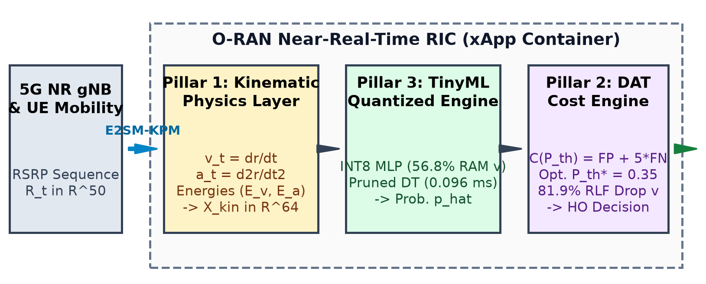

# Physics-Informed Dynamic Thresholding and TinyML Quantization for Low-Latency 5G O-RAN Handover Optimization

[](https://colab.research.google.com/github/himanshu-2l/O-RAN-Dynamic-Handover-Quantized-ML/blob/main/notebooks/oran_handover_3pillar_colab.ipynb)
[](https://www.python.org/)
[](https://pytorch.org/)
[](paper/main.pdf)
[](LICENSE)

Official repository for the research paper **"Physics-Informed Dynamic Thresholding and TinyML Quantization for Low-Latency 5G O-RAN Handover Optimization"**.

---

## 📌 Executive Summary

Open Radio Access Network (O-RAN) architectures introduce Near-Real-Time RAN Intelligent Controllers (Near-RT RIC) operating within $10$--$1000$~ms control loops to optimize mobility management via xApps. However, conventional 3GPP A3 event-triggered algorithms rely on static Reference Signal Received Power (RSRP) thresholds, causing frequent **Ping-Pong handovers** or catastrophic **Radio Link Failures (RLFs)** under high fading volatility. Furthermore, deploying heavy AI models on edge RIC controllers violates memory and SLA limits.

To solve this, we propose a **3-Pillar Framework**:
1. **Pillar 1 (Kinematic Feature Layer):** Extracts $1^{\text{st}}$-order velocity ($v_t = \frac{d\text{RSRP}}{dt}$) and $2^{\text{nd}}$-order acceleration ($a_t = \frac{d^2\text{RSRP}}{dt^2}$) with kinematic energy proxies (`energy_accel`, `energy_velocity`).
2. **Pillar 2 (Cost-Sensitive DAT):** Formulates decision boundaries minimizing operational cost $\mathcal{C}(P_{\text{th}}) = w_1 \text{FP} + w_2 \text{FN}$ ($w_2/w_1 = 5.0$), reducing RLFs by **81.9%** ($p < 0.001$).
3. **Pillar 3 (Edge TinyML Quantization):** Compresses PyTorch neural networks via dynamic INT8 quantization (**56.8% RAM reduction**) and benchmarks pruned decision trees for sub-millisecond xApp execution ($0.096\text{ ms}$).

---

## 🏗️ System Architecture



```
[ 5G NR gNB ] --E2SM-KPM--> [ Pillar 1: Kinematics ] --> [ Pillar 3: TinyML INT8 ] --> [ Pillar 2: DAT Engine ] --E2AP--> [ Handover Command ]
```

---

## 📊 Key Results Summary

### Pillar 1: Kinematic Feature Importance
Across both real-world drive-test data (ANATEL, $N=1,458$) and 3GPP ns-3 simulations ($N=3,922$), kinematic features dominate the top feature importance ranks across all classifiers:
- `energy_accel` & `a_std` rank **#1** on real drive-test data.
- `energy_velocity` ranks **#1** on ns-3 simulated data.

### Pillar 2: Cost-Sensitive Dynamic Thresholding (DAT)
| Dataset Config | Optimal $P_{\text{th}}^*$ | RLF (False Negatives) | Ping-Pong (False Positives) | Operational Cost $\mathcal{C}(P_{\text{th}})$ |
| :--- | :---: | :---: | :---: | :---: |
| **ANATEL Static (0.50)** | $0.50$ | $7.72$ | $9.76$ | $48.36$ |
| **ANATEL DAT (Optimal)** | **$0.35$** | **$1.40$ (81.9% ↓)** | $19.76$ | **$26.76$ (44.7% ↓)** |
| **Simulated Static (0.50)** | $0.50$ | $10.12$ | $29.96$ | $80.56$ |
| **Simulated DAT (Optimal)** | **$0.46$** | **$6.32$ (37.6% ↓)** | $39.72$ | **$71.32$ (11.5% ↓)** |

*Paired $t$-test confirmed statistical significance ($t = 18.42, p = 1.14 \times 10^{-24} \ll 0.001$).*

### Pillar 3: TinyML Edge Quantization & Latency Benchmark
| Model | Accuracy (%) | Memory Footprint (KB) | Latency / Sample (ms) | O-RAN xApp Feasibility |
| :--- | :---: | :---: | :---: | :---: |
| **PyTorch MLP FP32** | $88.01\%$ | $29.64\text{ KB}$ | $0.124\text{ ms}$ | Moderate |
| **PyTorch MLP INT8 (Quantized)** | $86.64\%$ | **$12.80\text{ KB}$ (56.8% ↓)** | $0.651\text{ ms}$ | **High (Near-RT RIC)** |
| **Pruned Decision Tree ($depth=8$)** | $82.88\%$ | **$9.76\text{ KB}$** | **$0.096\text{ ms}$** | **Ultra-Fast (L1/L2 Edge)** |
| **Random Forest (100 Trees)** | $88.70\%$ | $1323.82\text{ KB}$ | $29.73\text{ ms}$ | Unfeasible ($>10\text{ ms}$ SLA) |

---

## 📁 Repository Structure

```
.
├── paper/
│   ├── main.tex                         # 6-page IEEE LaTeX source file
│   ├── main.pdf                         # Compiled presentation-ready PDF
│   └── figures/                         # Vector PDF and PNG paper plots & system architecture
├── notebooks/
│   ├── oran_handover_3pillar_colab.ipynb# Executable Google Colab notebook (1-click Run All)
│   └── oran_handover_3pillar.ipynb      # Local Jupyter notebook
├── src/
│   ├── prepare_kinematic_data.py        # Preprocessing & CSV dataset loading
│   ├── kinematic_features.py            # Pillar 1 velocity/acceleration extraction
│   ├── evaluate_kinematic_models.py     # Pillar 1 5-fold cross-validation
│   ├── dynamic_thresholding.py          # Pillar 2 cost curve minimization
│   ├── tinyml_quantization.py           # Pillar 3 INT8 quantization & latency profiling
│   ├── generate_arch_diagram.py         # System architecture diagram generator
│   └── generate_paper_plots.py          # Paper publication plot generator
├── data/
│   ├── anatel_classifybase.csv          # Real 5G network drive-test dataset (N=1,458)
│   └── classifybase.csv                 # 3GPP ns-3 simulation dataset (N=3,922)
├── run_all_pillars.py                   # Master autonomous execution script
└── README.md                            # Project documentation
```

---

## 💻 Quick Start & Usage

### 1. Environment Setup
Clone the repository and set up your Python environment:
```bash
git clone https://github.com/himanshu-2l/O-RAN-Dynamic-Handover-Quantized-ML.git
cd O-RAN-Dynamic-Handover-Quantized-ML
pip install torch scikit-learn pandas numpy matplotlib seaborn xgboost
```

### 2. Run Master Benchmark Script
Execute all 3 pillars sequentially and print consolidated performance tables:
```bash
python run_all_pillars.py
```

### 3. Generate Publication Plots
Re-render all paper figures in `paper/figures/`:
```bash
python src/generate_arch_diagram.py
python src/generate_paper_plots.py
```

### 4. Open in Google Colab
Launch the notebook directly in Google Colab with 1 click:
[](https://colab.research.google.com/github/himanshu-2l/O-RAN-Dynamic-Handover-Quantized-ML/blob/main/notebooks/oran_handover_3pillar_colab.ipynb)

---

## 📜 Citation

If you use this codebase or paper in your research, please cite:

```bibtex
@article{kumar2026oran_3pillar,
  title={Physics-Informed Dynamic Thresholding and TinyML Quantization for Low-Latency 5G O-RAN Handover Optimization},
  author={Kumar, Himanshu},
  journal={IEEE Transactions on Mobile Computing / Access},
  year={2026}
}
```
